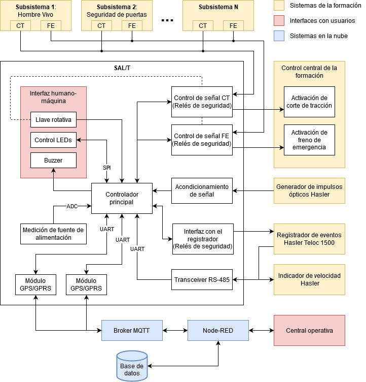

# Firmware del SAL/T (Sistema de Aislamiento Limitado/Total)
## Introducción

El presente proyecto tiene por objetivo desarrollar el firmware necesario para el funcionamiento de un SAL/T.

El mismo es un dispositivo de seguridad ferroviaria que permite al maquinista de una formación detenida por inconvenientes técnicos activar un modo de funcionamiento limitado.

El equipo toma el control de las señales de corte de tracción y freno de emergencia permitiendo al conductor mover la formación siempre que no se supere una velocidad máxima y que exista una señal de permiso de circulación emitida por la central operativa del ramal.

### Diagrama de bloques funcionales



## Configuración

### Setup

Para configurar el proyecto se requiere seguir los siguientes pasos:

- Instalar el IDE [MCUXpresso](https://www.nxp.com/design/software/development-software/mcuxpresso-software-and-tools/mcuxpresso-integrated-development-environment-ide:MCUXpresso-IDE) basado en Eclipse.
- Clonar el proyecto con la opción `--recursive` para obtener los submódulos.
    ```
    git clone --recursive https://github.com/nahueespinosa/salt-firmware.git
    ```
- Importar el proyecto desde la carpeta `salt-firmware\salt\arch\edu-ciaa-nxp\build` (no la raíz).

### Debug

Para debuggear el proyecto en la placa EDU-CIAA-NXP desde MCUXpresso se requiere seguir los siguientes pasos:

- Instalar [OpenOCD](http://openocd.org/) en el sistema o usar el que viene instalado en el [paquete de software de la CIAA](https://github.com/ciaa/software).
- Desde el menú "Help -> Eclipse Marketplace" en MCUXpresso, buscar e instalar el plugin "GNU MCU Eclipse 4.7.2" seleccionando los siguientes paquetes
    - GNU MCU C/C++ ARM Cross Compiler
    - GNU MCU C/C++ RISC-V Cross Compiler
    - GNU MCU C/C++ OpenOCD Debugging

- Abrir "Debug Configurations" y crear una nueva configuración a partir de "GDB Open OCD Debugging".
- En la pestaña "Debugger" se deben hacer las siguientes configuraciones.
    - En "OpenOCD Setup" cambiar "Executable path" por el de la instalación de OpenOCD (puede ser del paquete de software de la CIAA: *C:\CIAA\tools\openocd\bin\openocd.exe*)
    - En "OpenOCD Setup" cambiar "Config options" por `-f ../../../../ftdi_lpc4337.cfg`.
    - En "GDB Client Setup" cambiar "Executable name" por `arm-none-eabi-gdb`.
- Confirmar los cambios, conectar un cable USB al puerto de DEBUG de la EDU-CIAA-NXP y presionar el botón Debug.