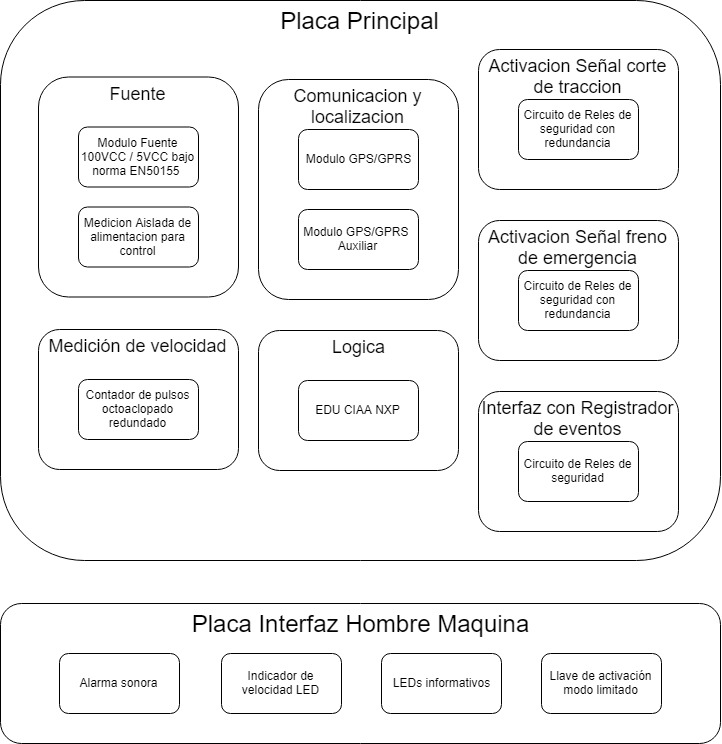

# Firmware del SAL/T (Sistema de Aislamiento Limitado/Total)
## Introducción

El presente proyecto tiene por objetivo desarrollar el firmware necesario para el funcionamiento de un SAL/T.

El mismo es un dispositivo de seguridad ferroviaria que permite al maquinista de una formación detenida por inconvenientes técnicos activar un modo de funcionamiento limitado.

El equipo toma el control de las señales de corte de tracción y freno de emergencia permitiendo al conductor mover la formación siempre que no se supere una velocidad máxima y que exista una señal de permiso de circulación emitida por la central operativa del ramal.

## Diagrama de bloques funcionales



## Configuración del proyecto

Para compilar el proyecto se requiere seguir los siguientes pasos:

- Instalar el IDE [MCUXpresso](https://www.nxp.com/design/software/development-software/mcuxpresso-software-and-tools/mcuxpresso-integrated-development-environment-ide:MCUXpresso-IDE) basado en Eclipse.
- Clonar el proyecto con la opción `--recursive` para obtener los submódulos.
    ```
    git clone --recursive https://github.com/nahueespinosa/salt-firmware.git
    ```
- Importar el proyecto desde la carpeta `salt-firmware\salt\arch\edu-ciaa-nxp\build` (no la raíz).